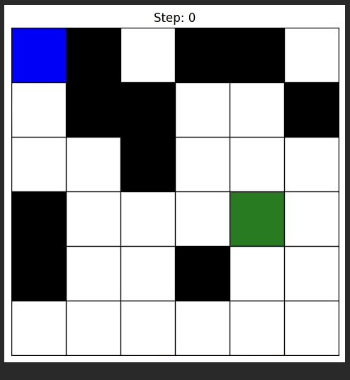

# Q-Learning Agent vs. BFS Benchmark 🤖

A practical implementation of the fundamental **Reinforcement Learning** concepts discussed in my research paper, *"Game AI Development using Reinforcement Learning"*.

## 📄 Research Context
[cite_start]This project serves as a code demonstration for **Section 2.1.A (Q-Learning)** of the associated research paper published in IJIRT[cite: 61]. [cite_start]While the paper reviews advanced architectures like Deep Q-Networks (DQN) and Actor-Critic methods[cite: 10], this repository focuses on benchmarking the foundational **Tabular Q-Learning** algorithm against classical pathfinding (BFS).

* [cite_start]**Paper:** [Game AI Development using Reinforcement Learning (IJIRT)](https://ijirt.org/publishedpaper/IJIRT181050_PAPER.pdf) [cite: 1]
* [cite_start]**Focus:** Implementing the value-based, model-free algorithm described in **Table I** of the paper[cite: 93].

## 🧪 The Experiment
[cite_start]As discussed in the paper's section on **"NPC Decision-Making"**[cite: 97], RL agents can learn complex behaviors over time. This project tests that theory by pitting an RL agent against a mathematically perfect **Breadth-First Search (BFS)** solver.

* [cite_start]**Grid World:** A dynamic 6x6 environment representing a simplified game map[cite: 93].
* **The Agent:** Uses the Bellman Equation to update a Q-Table:
    $$Q(s,a) = Q(s,a) + \alpha [R + \gamma \max Q(s',a') - Q(s,a)]$$
* [cite_start]**The Result:** The agent successfully converged to the optimal path (matching BFS steps) after ~300 episodes, demonstrating the "Trial and Error" learning process described in the abstract[cite: 7, 27].

## 🎥 Visualization

*(The Blue Agent learns to navigate around Black Obstacles to reach the Green Goal)*

## 🛠️ Tech Stack
* **Language:** Python 3.x
* **Libraries:** NumPy (Math), Matplotlib (Visualization)
* [cite_start]**Algorithm:** Tabular Q-Learning (Model-Free RL) [cite: 62]

## 📂 Installation & Usage
1. Clone the repository:
   ```bash
   git clone [https://github.com/YOUR_USERNAME/q-learning-pathfinding.git](https://github.com/YOUR_USERNAME/q-learning-pathfinding.git)
